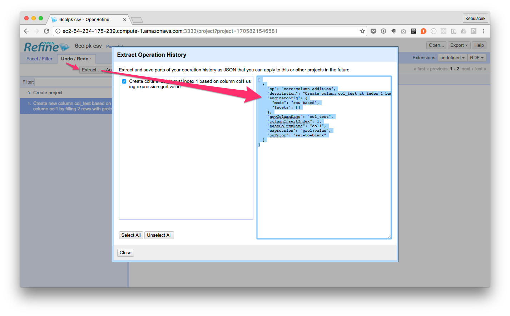

# OpenRefine Transformation

[](https://travis-ci.org/keboola/openrefine-transformation)
[](https://quay.io/repository/keboola/openrefine-transformation)

WORK IN PROGRESS!

## Version

The current version is **OpenRefine 2.6 RC 2**. 
Batch processing uses [OpenRefine PHP Client](https://github.com/keboola/openrefine-php-client). 

## Build

```
git clone https://github.com/keboola/openrefine-transformation
cd openrefine-transformation
docker-compose build
```

## Development

Run OpenRefine server using

```
docker-compose up devel
```

Then you can start running tests using 

```
docker-compose run --rm tests
```

If you want to specify a custom OpenRefine server

```
docker-compose run -e OPENREFINE_HOST=host OPENREFINE_PORT=3333 --rm tests
```

## OpenRefine Sandbox 

### Local Build

```
git clone https://github.com/keboola/openrefine-transformation
cd openrefine-transformation
docker-compose build
docker-compose run sandbox
```

And point your browser to [localhost:3333](http://localhost:3333)


### Pull from Quay.io
 
```
git clone https://github.com/keboola/openrefine-transformation
cd openrefine-transformation
docker pull quay.io/keboola/openrefine-transformation
docker image tag quay.io/keboola/openrefine-transformation keboola/openrefine-transformation
docker-compose run sandbox
```

And point your browser to [localhost:3333](http://localhost:3333)

### Storing transformation

Go to *Undo / Redo* and click on *Extract...* button. JSON representation of the transformation is available. 
From there you can copy & paste it where required.




## License

MIT licensed, see [LICENSE](./LICENSE) file.
